# FedDev 43 - Custom Fedora Developer Live ISO

> **BSc Computing Dissertation Artifact** · University of Bolton · CLD6001  
> Student: George Maistrelis (2331873) · Supervisor: Mr. Georgios Prokopakis

A custom **Fedora 43 GNOME Live ISO** built to demonstrate that Linux can be configured, automated, and deployed as a production-ready developer workstation for workplace use. The project includes the ISO build system, an interactive CLI builder, and a Zenity GUI wrapper - all built on top of the official Fedora kickstart toolchain.

---

## Screenshots

### The ISO - Live Session

| GRUB Boot | GNOME Desktop | Nautilus (Files) |
|-----------|--------------|------------------|
| 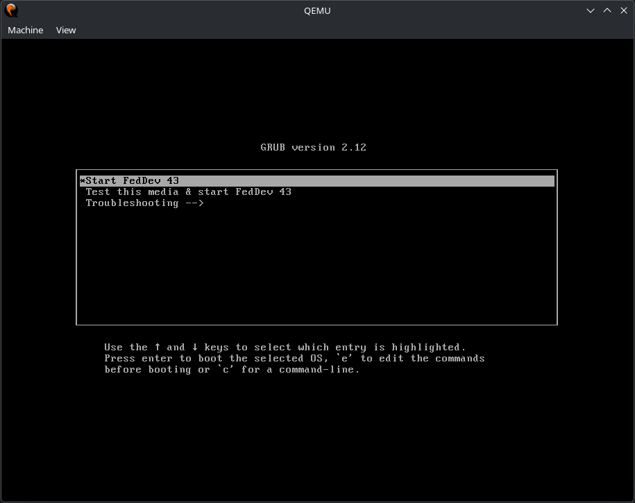 | 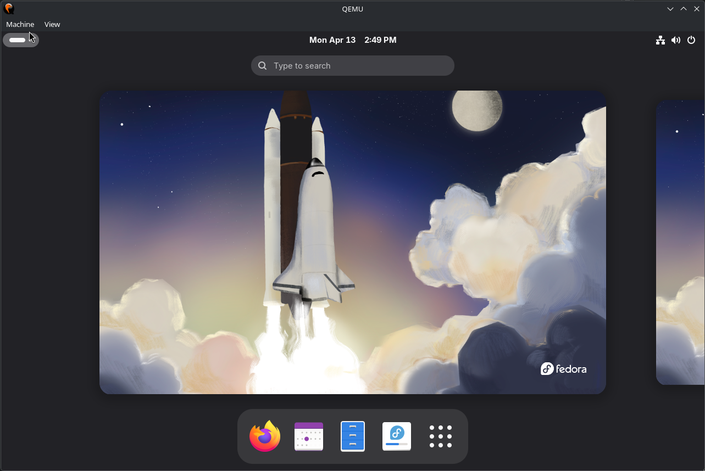 | 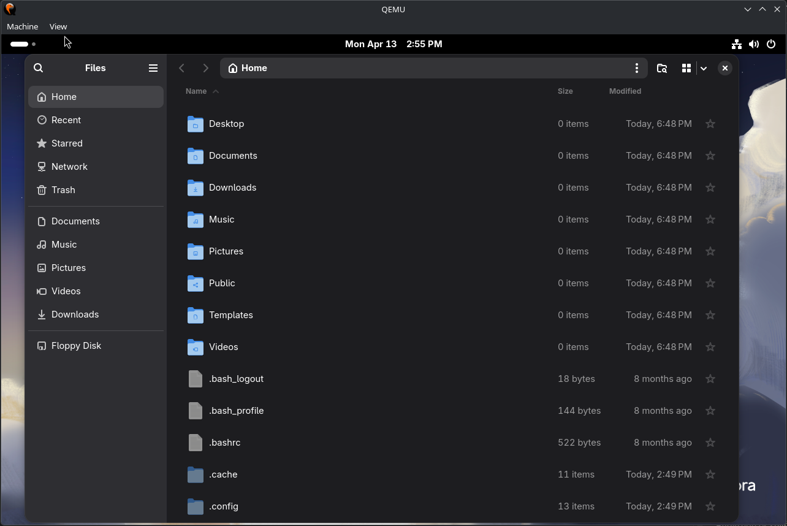 |

| MOTD on Terminal Start | dev-check Output | Modern CLI Tools |
|----------------------|-----------------|-----------------|
| 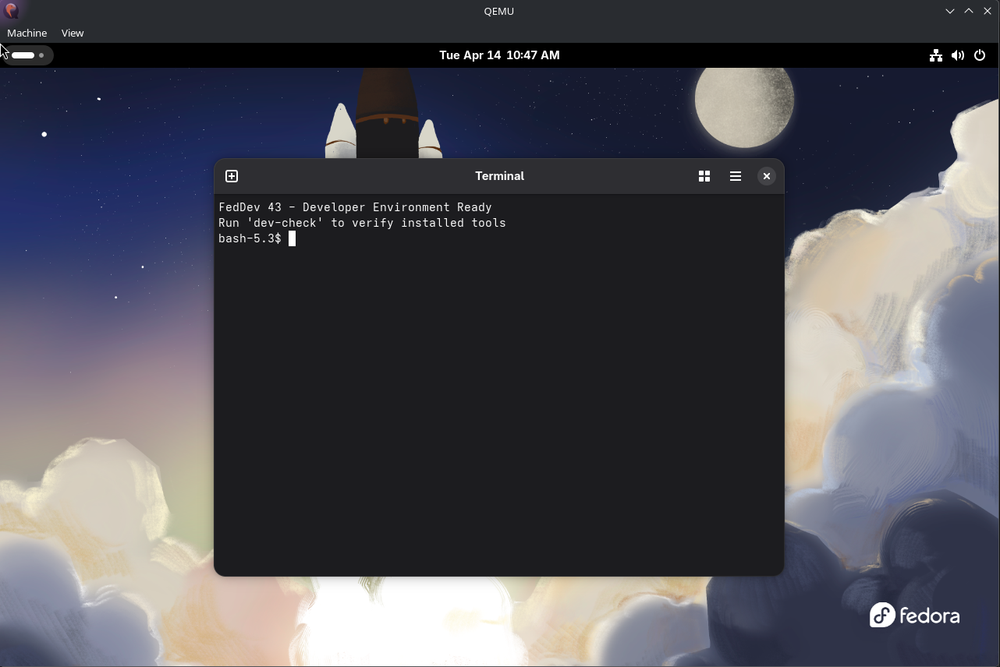 | 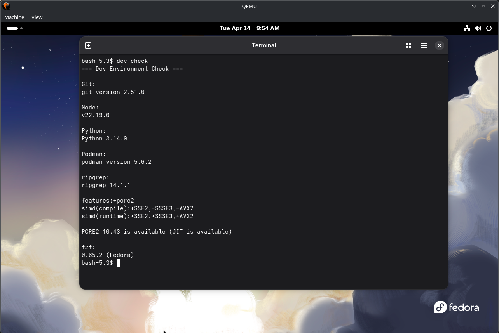 | 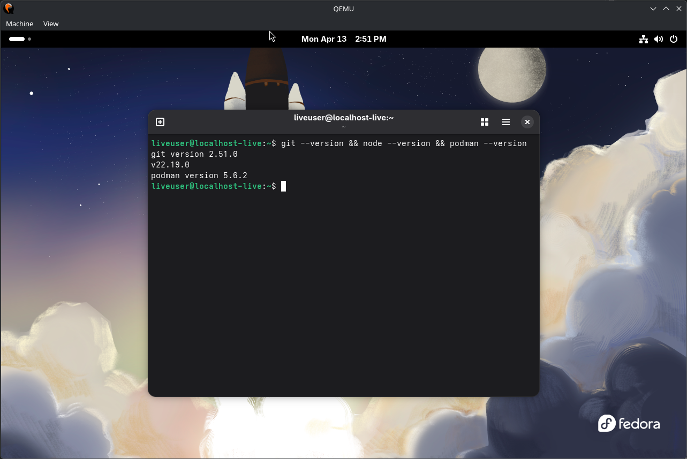 |

### Interactive ISO Builder (v1.6)

| Main Menu | Build Configuration | Custom Config |
|-----------|-------------------|--------------|
| 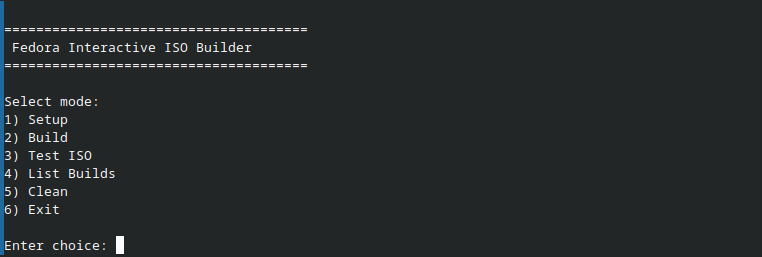 | 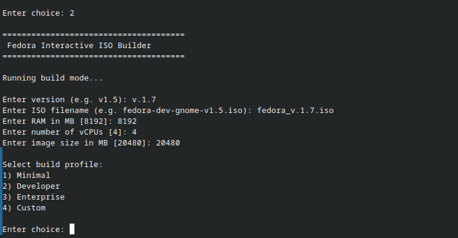 | 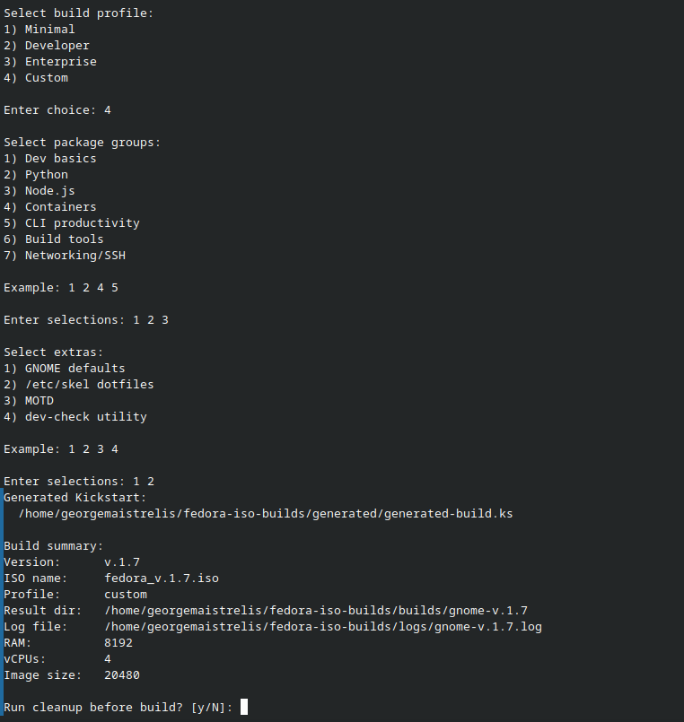 |

| ISO Test Launch | List Builds | Final Desktop |
|----------------|------------|--------------|
| 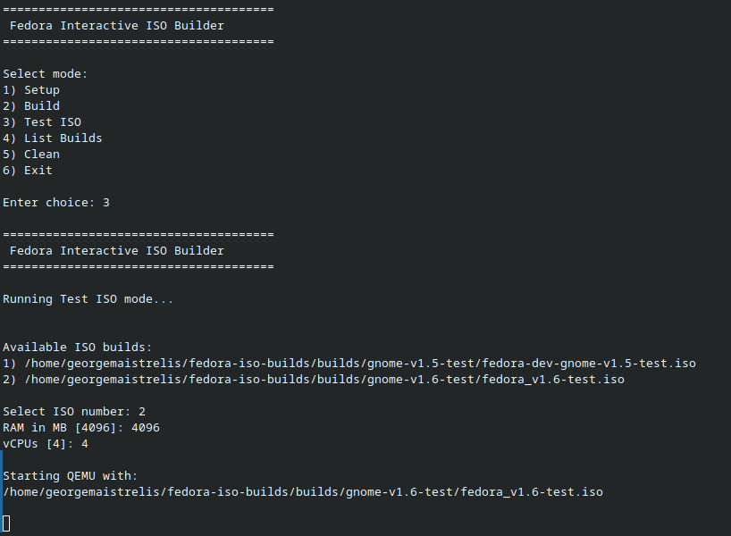 | 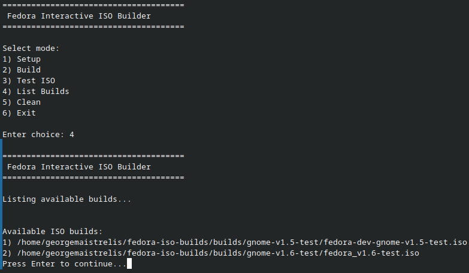 |  |

### GUI Builder (v2)

| GUI Main Menu | GUI List Builds | GUI ISO Select |
|--------------|----------------|---------------|
| 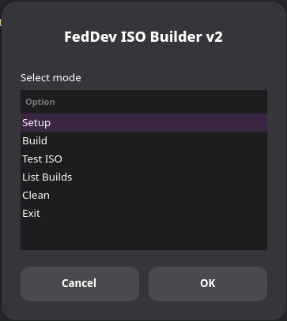 | 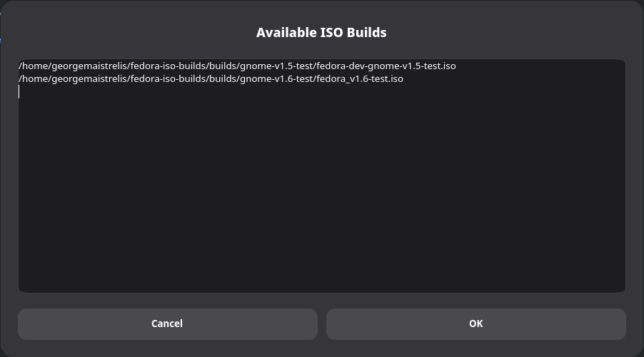 | 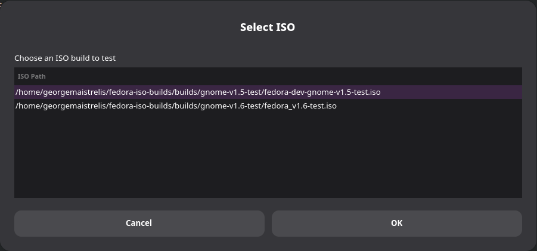 |

---

## What Is This?

This repository contains the complete build system for **FedDev 43** - a custom Fedora 43 Live ISO designed for developer workplace deployment. The project demonstrates:

- **Technical feasibility**: A bootable, developer-ready Linux environment built entirely from official Fedora sources using the Kickstart + livemedia-creator toolchain
- **Enterprise customisation**: A build pipeline that can produce tailored ISO variants (minimal, developer, enterprise) from a single codebase
- **Automation**: From manual kickstart editing to a GUI-driven point-and-click builder - the entire build process is accessible to non-expert users

---

## Features

### Pre-installed Developer Tools

| Category | Tools |
|----------|-------|
| Version Control | git |
| Languages | python3, python3-pip, nodejs, npm |
| Containers | podman, buildah, skopeo, toolbox |
| CLI Productivity | bat, ripgrep, fzf, fd-find, jq, tree, tmux, htop |
| Build Tools | gcc, gcc-c++, make, ShellCheck |
| Networking | openssh-clients, curl, wget |
| Editor | vim-enhanced |

### System-Wide GNOME Customisation

Applied via `dconf` system database - affects all users at first boot, overridable per-user:

- **Dark mode** enabled by default (`prefer-dark`)
- **Nautilus**: hidden files visible, list view as default
- **Clock**: weekday shown in panel
- **Touchpad**: tap-to-click enabled

### User Environment (`/etc/skel`)

Every user account (live and installed) receives:

- **`.bashrc`** - Git aliases (`gs`, `gp`), `ll` alias, `dc` shortcut for `dev-check`, MOTD display on terminal start
- **`.gitconfig`** - Template with sane defaults (main branch, rebase pull)
- **`.vimrc`** - Line numbers, syntax highlighting

### `dev-check` Utility

```bash
dev-check   # or: dc
```

Validates the entire developer toolchain in one command - confirms git, Node.js, Python, Podman, ripgrep, and fzf are installed and prints their versions.

### MOTD (Message of the Day)

Displayed automatically on every terminal start:
```
FedDev 43 - Developer Environment Ready
Run 'dev-check' to verify installed tools
```

---

## Repository Structure

```
fedora-custom-developer-iso/
├── README.md
├── kickstarts/
│   ├── flat-workstation-base.ks      # Flattened official Fedora 43 Workstation KS
│   └── my-dev-workstation-v1.2.ks   # Final custom kickstart (builds v1.4 ISO)
├── tools/
│   ├── interactive-iso-builder.sh   # Interactive CLI builder (v1.6)
│   └── gui-builder-v2.sh            # Zenity GUI wrapper (v2)
├── docs/
│   └── interactive-builder.md       # Builder documentation
├── screenshots/
│   ├── v1.4/                        # ISO validation screenshots
│   └── v1.6/                        # Builder and GUI screenshots
├── logs/                            # Sample build logs
└── checksums/                       # SHA256 checksums for ISO builds
```

---

## Build Instructions

### Prerequisites

Fedora 43 host with:

```bash
sudo dnf install -y lorax-lmc-novirt pykickstart git
```

### Option A - Interactive Builder (Recommended)

```bash
git clone https://github.com/MaistrelisGeorge/fedora-custom-developer-iso.git
cd fedora-custom-developer-iso/tools
chmod +x interactive-iso-builder.sh
./interactive-iso-builder.sh
```

The builder will guide you through:
1. Downloading the Fedora 43 netinstall ISO
2. Selecting a profile (Minimal / Developer / Enterprise / Custom)
3. Choosing optional extras (GNOME defaults, dotfiles, MOTD, dev-check)
4. Building the ISO automatically

### Option B - GUI Builder

```bash
chmod +x tools/gui-builder-v2.sh
./tools/gui-builder-v2.sh
```

Requires `zenity` (`sudo dnf install -y zenity`). Provides a point-and-click interface to the same build pipeline.

### Option C - Manual Build

```bash
# 1. Download Fedora 43 netinstall ISO
wget https://dl.fedoraproject.org/pub/fedora/linux/releases/43/Everything/x86_64/iso/Fedora-Everything-netinst-x86_64-43-1.6.iso

# 2. Set SELinux to permissive (required for build)
sudo setenforce 0

# 3. Build
systemd-inhibit --what=idle:sleep \
sudo livemedia-creator \
  --make-iso \
  --iso=Fedora-Everything-netinst-x86_64-43-1.6.iso \
  --ks=kickstarts/my-dev-workstation-v1.2.ks \
  --resultdir=./output \
  --logfile=./build.log \
  --project="FedDev" \
  --volid="FEDDEV43" \
  --iso-only \
  --iso-name="fedora-dev-workstation.iso" \
  --releasever=43 \
  --ram=8192 \
  --vcpus=4 \
  --image-size=20480 \
  --no-virt

# 4. Restore SELinux
sudo setenforce 1
```

### Testing the ISO

```bash
qemu-system-x86_64 \
  -enable-kvm \
  -m 4096 \
  -cpu host \
  -smp 4 \
  -cdrom output/fedora-dev-workstation.iso
```

---

## Builder Profiles

The Interactive ISO Builder (v1.6) provides four profiles:

| Profile | Packages | Extras |
|---------|----------|--------|
| **Minimal** | Core dev tools + networking | GNOME defaults, dotfiles |
| **Developer** | Full toolset (Python, Node, containers, CLI tools, build tools) | GNOME defaults, dotfiles, MOTD, dev-check |
| **Enterprise** | Dev tools + Python + CLI tools + build tools + networking | GNOME defaults, dotfiles, MOTD |
| **Custom** | User-selected from menu | User-selected from menu |

---

## ISO Build History

| Version | Key Addition |
|---------|-------------|
| v1.0 | First working GNOME baseline - packages only |
| v1.1 | Extended developer toolset (Node, containers, CLI tools, build tools) |
| v1.2 | GNOME dconf customisation (dark mode, hidden files, list view) |
| v1.3 | `/etc/skel` dotfiles, `dev-check` script, MOTD |
| v1.4 | MOTD auto-display fix in GNOME Terminal via `.bashrc` - **final ISO** |

ISO files are not stored in this repository. SHA256 checksums are in `checksums/`.

---

## Academic Context

This project is the practical artifact for the dissertation:

> **"Assessing Desktop Linux for the Workplace"**  
> BSc Computing · University of Bolton · Module CLD6001 · May 2026

The ISO demonstrates that modern Linux distributions can be configured for workplace deployment with:
- **Zero manual setup** for end users - everything pre-configured
- **Reproducible builds** - the entire OS image can be recreated from source
- **Scalable customisation** - the builder generates department-specific variants from one codebase
- **Enterprise-grade tooling** - rootless containers (Podman), SELinux enforcing, locked root account

### Case Study Connection

This project's automated deployment approach directly addresses the lessons from real-world Linux workplace adoption: the French Gendarmerie's successful 72,000-workstation Ubuntu deployment, Germany's Schleswig-Holstein state migration, and the lessons of Munich's LiMux project - all of which identified management tooling and deployment automation as key success factors.

---

## Technical Notes

**Why `--no-virt` mode?**  
The `--no-virt` flag runs Anaconda directly on the host using lorax, without spawning a QEMU VM. This proved more reliable on this hardware configuration than virt mode, which experienced intermittent RPM transaction failures during early testing.

**Why GNOME over KDE?**  
KDE was attempted first but the f43 kickstart has KF5/KF6 package conflicts (RPM transaction error code 5) that cause build failures. The GNOME Workstation kickstart (`fedora-live-workstation.ks`) builds cleanly on Fedora 43.

**Why bootloader packages in `%packages`?**  
`grub2-pc-modules`, `grub2-efi-x64`, `shim-x64`, and `grub2-common` must be present inside the target image for lorax's `--no-virt` mode to complete the EFI boot structure. Without them, the ISO is not UEFI-bootable.

**Why dconf for GNOME defaults?**  
Running `gsettings` in `%post` fails because there is no active D-Bus session in the chroot environment. The dconf system database approach writes keyfiles to `/etc/dconf/db/local.d/` and compiles them with `dconf update` - this works without a running desktop session.

---

## Licence

MIT - see [LICENSE](LICENSE)

---

*Built with: Fedora 43 · livemedia-creator · Kickstart · Bash · Zenity*
