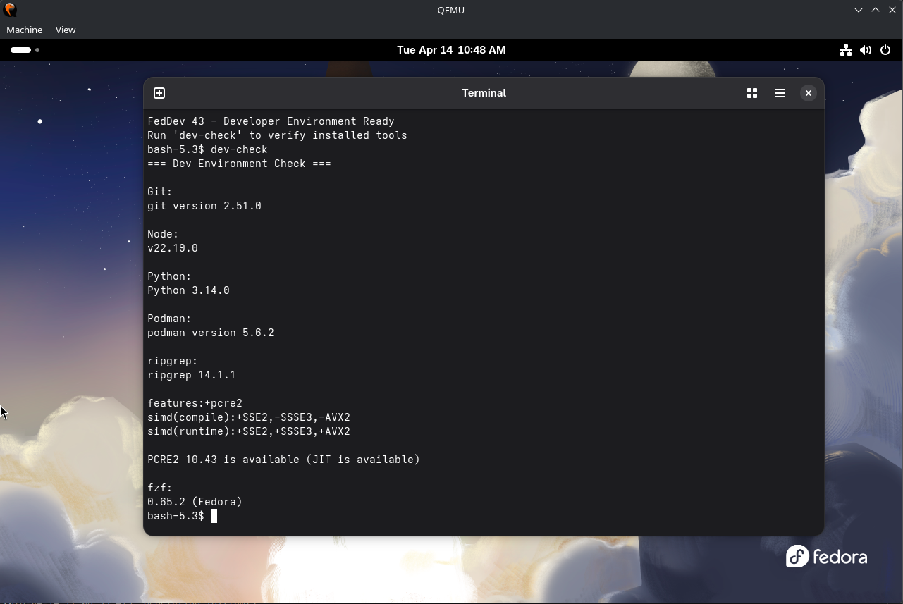
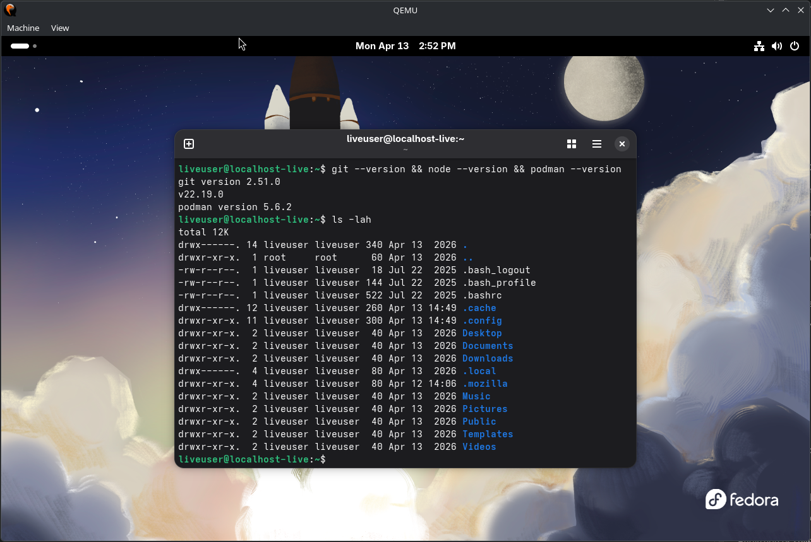
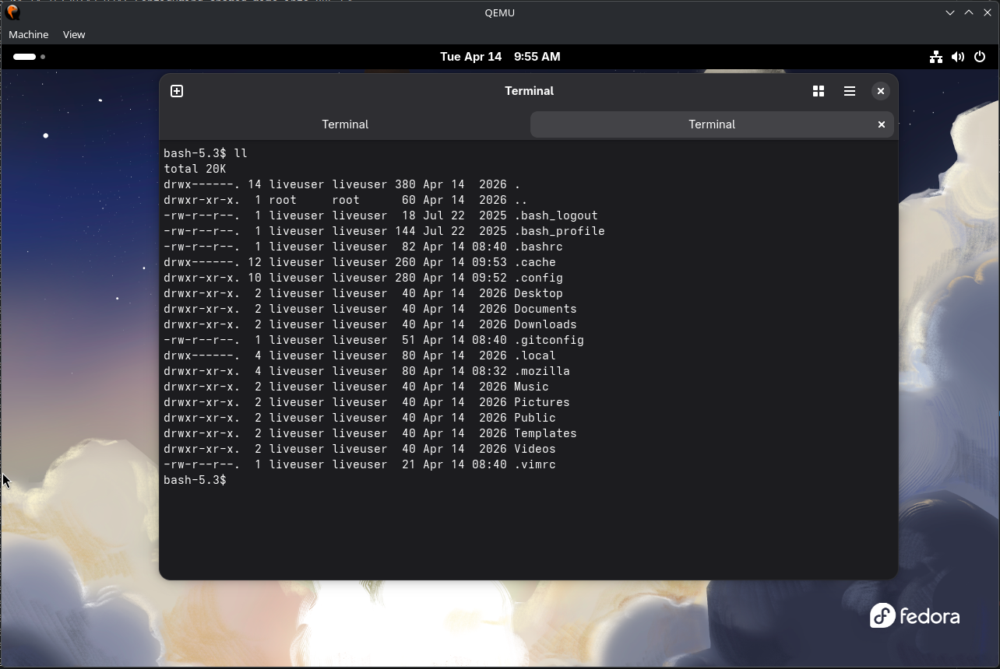

# Fedora Custom Developer ISO (FedDev 43)

## Project Overview

This project demonstrates the creation of a custom Fedora 43 Live ISO using Kickstart and the `livemedia-creator` toolchain.

The goal was to build a reproducible, developer-focused Linux environment with preinstalled tools, system-level customization, and a validated build process.

---

## Objectives

- Automate OS image creation using Kickstart
    
- Customize package selection for development workflows
    
- Apply system-wide GNOME configuration
    
- Provide a ready-to-use developer environment
    
- Ensure reproducibility and stability of the build process
    

---

## Technologies Used

- Fedora 43
    
- Kickstart (ksflatten)
    
- livemedia-creator (Lorax)
    
- QEMU with KVM acceleration
    
- GNOME Desktop Environment
    

---

## Build Process

### 1. Base Kickstart

The official Fedora Workstation Kickstart was flattened into a single file:

```bash
ksflatten \
  --config fedora-live-workstation.ks \
  -o flat-workstation-base.ks
```

---

### 2. Custom Kickstart

A custom Kickstart file was created to define:

- Package selection
    
- System configuration
    
- Post-install customization
    

---

### 3. ISO Build

```bash
systemd-inhibit --what=idle:sleep \
sudo livemedia-creator \
  --make-iso \
  --iso=Fedora-Everything-netinst-x86_64-43-1.6.iso \
  --ks=my-dev-workstation.ks \
  --resultdir=gnome-v1.4 \
  --logfile=gnome-v1.4.log \
  --project="FedDev" \
  --volid="FEDDEV43" \
  --iso-only \
  --iso-name="fedora-dev-gnome-v1.4.iso" \
  --releasever=43 \
  --ram=8192 \
  --vcpus=4 \
  --image-size=20480 \
  --no-virt
```

---

## Final Version (v1.4)

The final ISO includes:

- Preconfigured developer environment
    
- System-wide GNOME customization
    
- Default user configuration via `/etc/skel`
    
- Custom `dev-check` validation script
    
- Automatic MOTD display on terminal startup
    

---

## Key Features

### Developer Environment

The ISO includes essential development tools:

- Git
    
- Node.js and npm
    
- Python 3
    
- Podman and Buildah
    
- CLI tools such as ripgrep, fzf, jq, and tree
    

---

### System Customization

#### GNOME (dconf)

- Dark mode enabled by default
    
- Hidden files visible in file manager
    
- Default file view set to list
    
- Weekday displayed in the top panel
    

---

#### Default User Configuration (`/etc/skel`)

Each new user is provisioned with:

- `.bashrc` including useful aliases
    
- `.gitconfig` template
    
- `.vimrc` with basic settings
    

---

#### MOTD (Message of the Day)

A custom message is displayed automatically when opening a terminal:

```
FedDev 43 - Developer Environment Ready
Run 'dev-check' to verify installed tools
```

---

#### dev-check Script

A custom utility is available:

```bash
dev-check
```

It verifies that all development tools are installed and working correctly.

---

## Testing

The ISO was tested using QEMU with KVM acceleration:

```bash
qemu-system-x86_64 \
  -enable-kvm \
  -m 4096 \
  -cpu host \
  -smp 4 \
  -cdrom fedora-dev-gnome-v1.4.iso
```

Validation included:

- Boot verification
    
- Desktop environment loading
    
- Tool availability (`dev-check`)
    
- File system structure
    
- Terminal configuration
    

---

## Screenshots

### GRUB Boot Menu


### GNOME Desktop (Dark Mode)


### File Manager


### Terminal – MOTD


### Terminal – Development Environment Check


### File System View


### Terminal – Tool Versions


### Terminal – Alias Validation


---

## Repository Structure

```
kickstarts/        → Kickstart configuration files  
docs/              → Build commands and documentation  
screenshots/       → Validation screenshots  
checksums/         → ISO integrity hashes  
logs/              → Build logs  
```

---

## Customization Highlights

This project demonstrates:

- Automated OS customization using Kickstart
    
- Reproducible ISO builds using livemedia-creator
    
- System-level configuration (dconf, skel, MOTD)
    
- Developer environment validation via scripting
    

---

## Conclusion

This project provides a complete workflow for building a customized Linux distribution, combining automation, system configuration, and validation.

The final result is a stable, developer-oriented Fedora ISO suitable for further customization or enterprise use cases.
